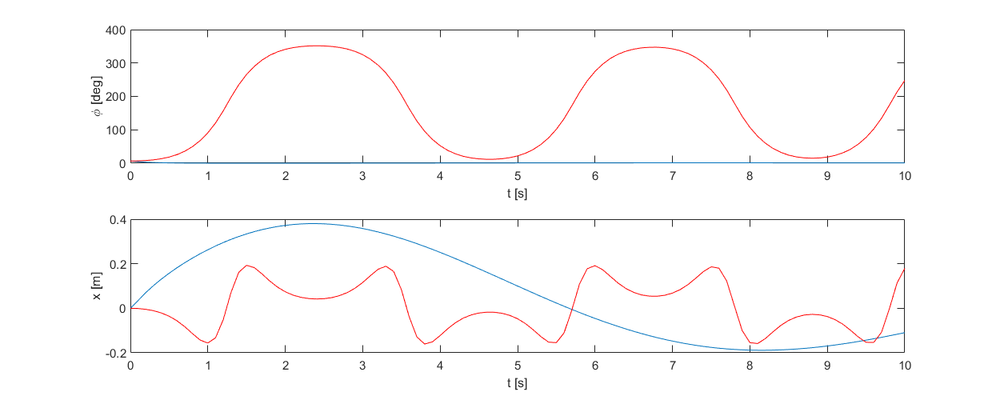
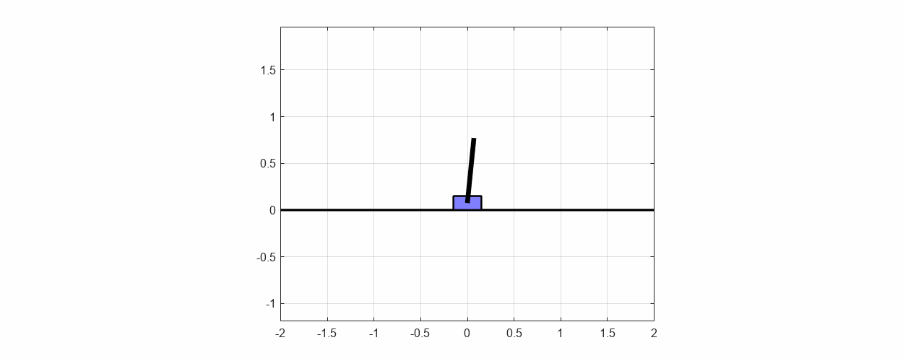

# InvertedPendulum

### Description:
Code for control of an inverted pendulum on a cart used for testing control algorithms on a nonlinear object. Inverted pendulum is controled by STM32L152RE nucleo board with pc graphical user interfece written in python. Control law is derived using a matlab live script.

### Stm32 code:
Code written in C using HAL library. It contains fixed point real time computation of a stepper motor step frequency and rotation, acquisition of data from an ultrasonic distance sensor and a magnetic encoder, procedures for communication with pc by uart.

### GUI:
Graphical user interfece written in python using tkinter package. It displays real time data, read from stm32 using pyserial package and displays it in graph form using matplotlib package. It allows for sending instructions to the stm and displays communicates and errors read from the stm.

### Control law derivation:
Currently the inverted pendulum is controlled using LQR, the gain matrix for LQR was derived in matlab using a state space model linearized aroud operating point.

### Acknowledgements:
- Project uses modified AS5600 magnetic encoder stm32 library originaly made by Nicholas Morrow [[https://github.com/nicholasmorrow/AS5600]]

### TODO:
- Implementing automatic swing up
- Overhouling fixed point computation functions to use dedicated arm cortex-m3 library for better perfomance
- Implementing saving collected data to csv file
