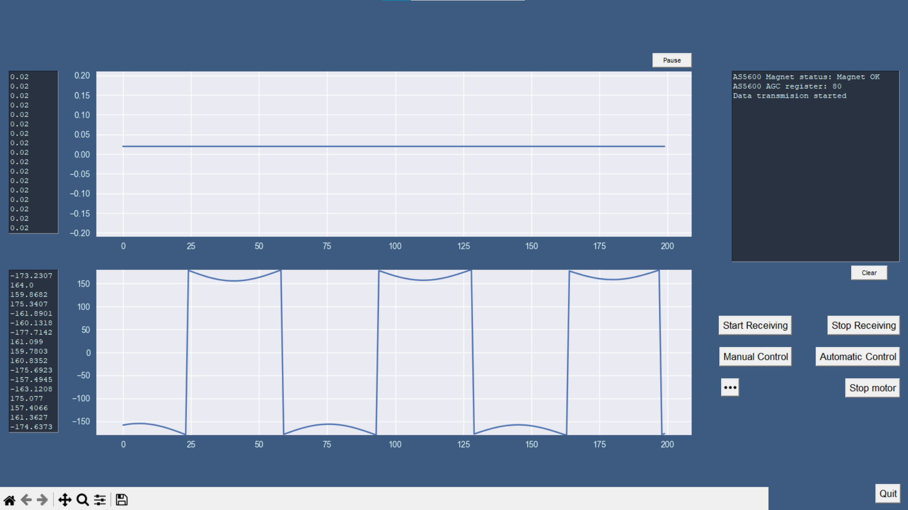
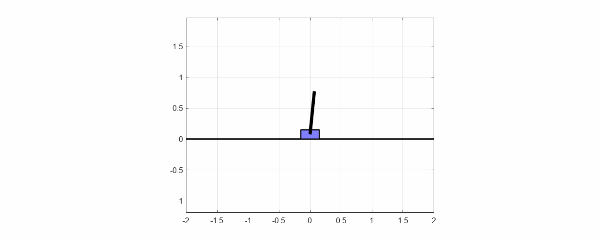
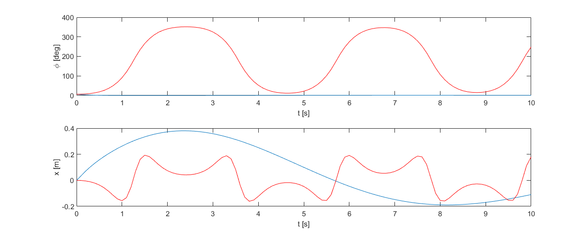

# InvertedPendulum

<video src = "https://user-images.githubusercontent.com/93823195/234073343-8e2aae81-15c9-49ab-a0d5-55e47947dc47.mp4">

### Description:
Code for control of an inverted pendulum on a cart.

### Stm32:
The pendulum is controlled by an stm32l152re microcontroller.

### GUI:
Graphical user interfece displays real time data read from stm32 via uart and displays it in graph form

  
### Control law:
The inverted pendulum is controlled using an LQR regulator.

  
### Acknowledgements:
- Project uses modified AS5600 magnetic encoder stm32 library made by [Nicholas Morrow](https://github.com/nicholasmorrow/AS5600)
